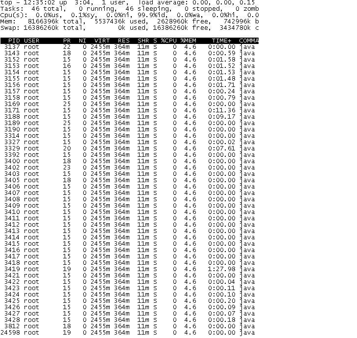

1. date:
    1.1 setting date
        date -s "2014-07-17 12:12:12"
        date -s 2014-07-17
        date -s 12:12:12
    1.2 format
        d=$(date +"%Y/%m/%d %T")
        echo $d
            >> 2014/07/17 06:02:46
2. zip:
    zip -r foo.zip foo
3. strace:
    strace -F -f -v -o output.txt java -version
    strace -x -T -tt -f -v -o output.txt java -version
4. ssh:
    ssh-kengen -t rsa ## gen key
    ssh-copy-id -i ~/.ssh/id_rsa.pub ${user}@${host}
    ssh ${user}@${host} "hostname"
    scp ./readme.txt ${user}@${host}:/home/leisore/readme.txt
5. expr:
    foo=`expr 8 \* 8`
6. ps:
    ps -ef | grep java | grep -v grep | awk '{print $2}' | xargs kill -9
7. for:
    7.1 traversal dir
        for f in `ls $PWD`
        do
            echo $f
        done
    7.2 traversal array
        FOO="20 50"
        for vfoo in $FOO
        do
            echo $vfoo
        done
8. if:
    8.1 file is existed?
        if [ -e "$PWD/r.txt" ]; then
            echo exist
        else
            echo dont exist
        fi
    8.2
        if [ "$1" == "foo" ]; then
            echo foo
        elif [ "$1" == "bar" ] || [ "$1" == "BAR" ] ; then
            echo bar
        else
            echo unknown
        fi
9. while:
    9.1 loop
        count=0
        while [ ${count} -lt 10 ]
        do
            echo $count
            count=`expr ${count} + 1`
            或者
            count=$((count+1))
        done
10. case:
    case $1 in
        "0")
            echo 0
            ;;
        "1")
            echo 1
            ;;
        "foo")
            echo foo
            ;;
        *)
            echo **
            ;;
    esac
11. function:
    function foo() {
        echo this is a foo function in shell, args is: $1, $2
    }
    foo $@
12. sed:
    12.1 substitute: lee-->eel
        sed s/lee/eel/g 1.txt
13. cal:
        display calendar.
14. show scoket attr:
        /proc/sys/net/ipv4/tcp_rmem (for read) and /proc/sys/net/ipv4/tcp_wmem (for write)
        they contain three numbers, which are minimum, default and maximum memory size values (in byte), respectively.
15. test net band-width/speed:
    server: iperf -s -i 5 -f M
    client: iperf -t 30 -i 5 -c 192.168.0.57 -f M
16. traffic control:
    show qdisc: 
        tc -s qdisc ls dev eth0
    reset tc set:
        tc qdisc del dev eth0 root
    set delay and loss:
        tc qdisc add dev eth0 root handle 1:0 netem delay 0ms loss 2%
17. split:
        var1=`echo $lee | cut -d ':' -f 1`
        var2=`echo $lee | cut -d ':' -f 2`
18. shell中的引号：
    单引号中的内容不会做替换,双引号中的内容会做替换:
        lee=eel
        echo '$lee'
            out: $lee
        echo $lee"
            out: eel
19. 进度条：
    function wait_seconds() {
        waitSec=$1
        sleepMills=$((waitSec*1000/100))
        count=$((waitSec*1000/sleepMills))
        cnt=1
        while [ $cnt -le $count]
        do
            usleep $((sleepMills*1000))
            echo -en "\rprogress:[$((cnt*100/count))]"
            cnt=$((cnt+1))
        done
    }

#### Top
##### 查看进程中的线程使用情况
    top -H -p pid
例如
    top -H -p 3137
输出如下：
    
其中
    Tasks: 即为线程总数
    CPU/Mem: 即为单个线程占用的CPU和内存

##### TODO
